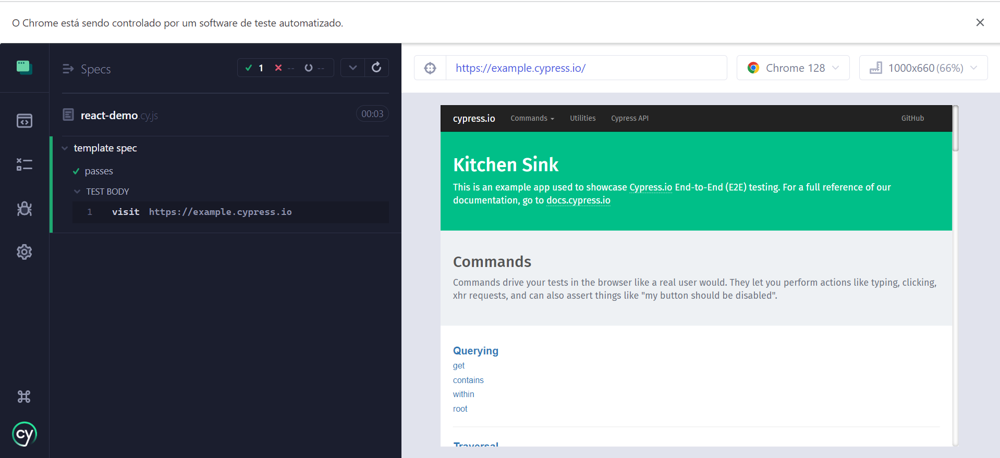
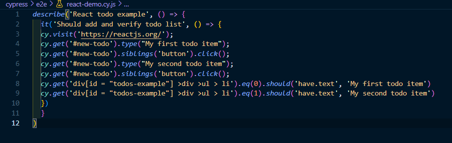
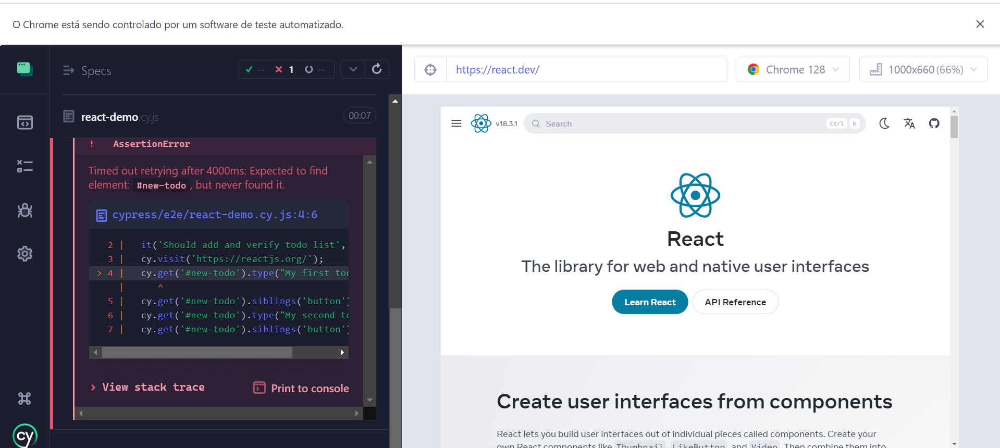
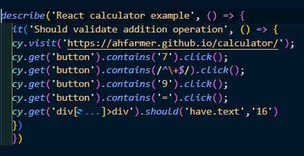
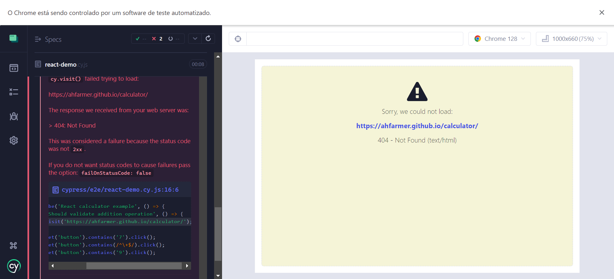

# Ponderada Semana 5 - Cypress

Este repositório contém a ponderada da semana 5, utilizando Cypress para testes de End-to-End (E2E).

## Visão Geral do Projeto

O projeto consiste em configurar e executar testes E2E em sites da web. Usamos o Cypress, uma ferramenta de teste moderna, para garantir que os componentes funcionem corretamente em um ambiente simulado de navegador.

### Passos Iniciais

1. **Inicialização do Projeto**:
   - O projeto foi iniciado com `npm init` para configurar o ambiente do Node.js.
   - Em seguida, o Cypress foi instalado e configurado para testes E2E.

    

2. **Testes Realizados**:

   * **Teste E2E para o Componente To-Do**:
     - Inicialmente, criamos um teste para o componente de to-do baseado no exemplo oficial do ReactJS. 
     - Infelizmente, a versão do componente original não está mais disponível, o que causou um erro durante a execução do teste.
      
      

   * **Teste E2E para a Calculadora**:
     - Um teste similar foi realizado para o componente de calculadora, que também não está mais disponível no site oficial.
     -  
     -  

### Técnicas e Conceitos de TDD Utilizados

O desenvolvimento orientado por testes (TDD) foi aplicado durante a criação e verificação dos componentes. As etapas básicas seguidas foram:

1. **Escrever o Teste**: Antes de implementar a funcionalidade, criamos um teste que define o comportamento esperado.
2. **Executar o Teste**: O teste inicialmente falha, pois a funcionalidade ainda não foi implementada.
3. **Implementar a Funcionalidade**: Escrevemos o código necessário para passar o teste, no caso, mudamos o endereço do site para um que esteja online.
4. **Refatoração**: Após o teste ser bem-sucedido, o código é revisado e melhorado sem alterar o comportamento externo, no caso, melhoramento de performance.
